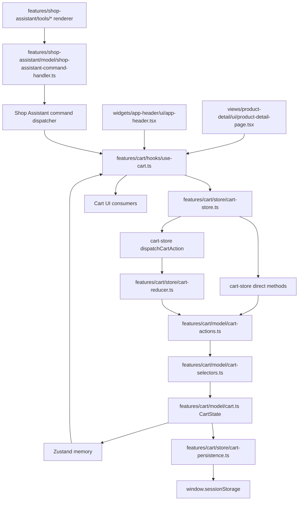

# Cart Architecture

The cart feature combines pure cart rules, Zustand client state, browser persistence, and UI consumers.



## Layer legend

| Layer | Responsibility |
| --- | --- |
| `model/cart.ts` | Cart types and action vocabulary. |
| `model/cart-actions.ts` | Pure operations that calculate the next cart. |
| `model/cart-selectors.ts` | Derived totals and normalized cart calculations. |
| `store/cart-reducer.ts` | Maps generic actions to pure cart operations. |
| `store/cart-store.ts` | Zustand state, local mutations, and persistence. |
| `store/cart-persistence.ts` | Safe browser `sessionStorage` access. |
| `hooks/use-cart.ts` | Stable React-facing cart facade. |
| `ui/` | Cart dropdown and cart-specific presentation. |

## The pieces

### Cart model

[`model/cart.ts`](./model/cart.ts) defines the shape of a cart item, the complete cart state, and the supported action vocabulary. It contains no React, Zustand, browser APIs, or network calls. This makes it the shared contract for the store, reducer, UI, and assistant adapter.

[`model/cart-actions.ts`](./model/cart-actions.ts) contains pure state transitions. Each function receives the current cart and returns the next cart for one operation such as adding an item or changing quantity. Because these functions are pure, they can be tested independently and reused by both direct store methods and the reducer.

[`model/cart-selectors.ts`](./model/cart-selectors.ts) calculates derived values such as total quantity and subtotal. The cart does not store duplicate totals that could become stale.

### Store and state access

[`store/cart-store.ts`](./store/cart-store.ts) is the Zustand state boundary. It owns the current in-memory cart, exposes named mutations, hydrates persisted state, and writes every accepted mutation to local persistence. Components should not call the store's internal `set` function or duplicate its mutation logic.

[`hooks/use-cart.ts`](./hooks/use-cart.ts) is the preferred consumer API. Header, cart page, product page, and other client components use this hook instead of importing Zustand directly. It provides a stable facade and keeps React lifecycle concerns such as hydration out of presentation components.

[`store/cart-reducer.ts`](./store/cart-reducer.ts) is a compatibility dispatch layer for callers that already express changes as `CartAction` values. It is not a second store and does not own state; it delegates to the pure operations in `model/cart-actions.ts`.

### Persistence boundary

[`store/cart-persistence.ts`](./store/cart-persistence.ts) contains browser-only `sessionStorage` access. Keeping this separate prevents storage checks and serialization details from leaking into UI code.

The cart is intentionally local-only during the server-first pages phase. The future database-backed cart should introduce a new server boundary instead of reviving the deleted `app/api/shop/cart` route directly inside the store.

Future integration can be added behind the same `useCart` facade. Good options are a feature-owned API client that synchronizes confirmed cart state after local mutation, or server callbacks/actions passed into a cart integration boundary when authenticated database carts are introduced. In both cases, keep UI components and assistant commands talking to `useCart`, and keep network/auth/database details outside presentation components.

### Consumers and assistant integration

[`ui/cart-header-dropdown.tsx`](./ui/cart-header-dropdown.tsx) and its colocated UI components render cart controls in the header. They receive cart data and callbacks; they do not own cart state.

[`widgets/app-header/ui/app-header.tsx`](../../widgets/app-header/ui/app-header.tsx) adapts the store's cart items into the dropdown's display model.

[`features/shop-assistant/model/shop-assistant-command-handler.ts`](../shop-assistant/model/shop-assistant-command-handler.ts) translates assistant commands into cart operations. This keeps the generic AI assistant unaware of both the cart store and ShopMate's data model.

## Update flow

```text
user interaction
  → useCart mutation
    → calculate next state
      → update Zustand immediately
        → persist locally
```

The assistant follows the same cart path through a typed command handler. It does not import the Zustand store directly.
