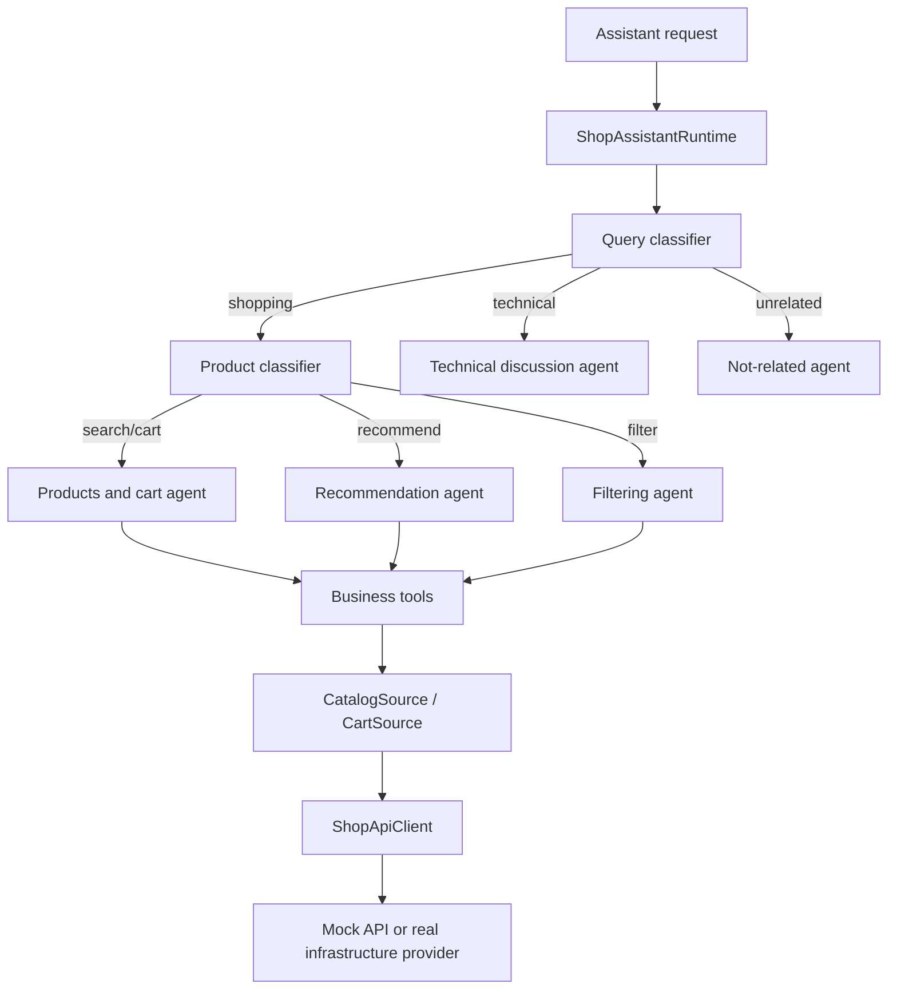
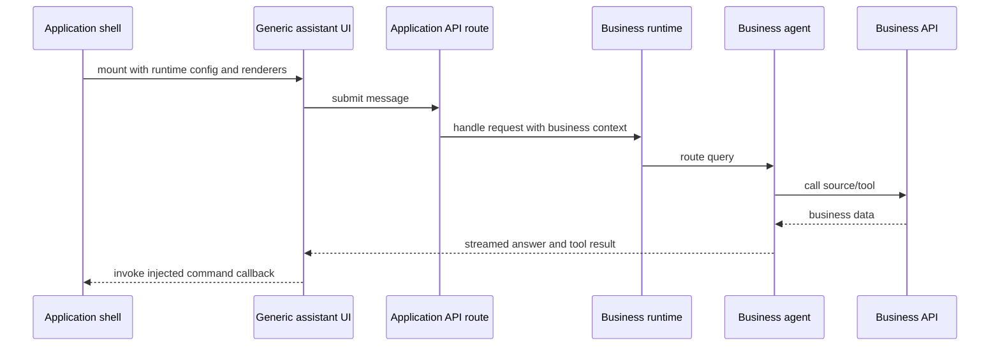

# Shop Assistant

ShopMate-specific adapter for the reusable AI assistant feature.

This package owns the electronics catalog prompts, product/cart data sources, product/cart tools, ShopMate agent routing, and product/cart tool renderers. The reusable assistant core imports only generic contracts from `features/ai-assistant`; app entry points inject this adapter where ShopMate behavior is needed.

## Owns

- ShopMate `AssistantRuntime` implementation for `/api/ai-assistant`.
- Electronics-specific query classification, product classification, agent prompts, and routing.
- Catalog and cart source contracts used by ShopMate tools.
- Current mock Shop API and focused catalog/cart source adapters.
- Product/cart tool factories and UI renderer registry.
- App-level assistant integration component that injects ShopMate renderers and stream handling.

## Dependency Rules

- This adapter may import contracts and generic UI/server helpers from `features/ai-assistant`.
- `features/ai-assistant` must not import this adapter.
- Routes may import this adapter only to inject runtime composition.
- Product/cart state remains in `features/shop`; this adapter reads it through explicit source/controller contracts.

See [`server/README.md`](./server/README.md) for the server folder responsibilities and database-provider boundary.

## Agent routing architecture



The router chooses behavior; agents decide how to answer; tools perform structured operations; sources provide business data. Keep these responsibilities separate so changing the database does not require rewriting agents.

## How tools work

1. An agent declares a tool with a validated input schema.
2. The model requests the tool with structured arguments.
3. The tool calls a focused `CatalogSource` or `CartSource` contract.
4. The tool returns serializable data to the model and emits tool-result data to the stream.
5. The client-side renderer registry maps the tool name to a business UI component.
6. UI actions use an injected command callback to update application state; the assistant does not import the cart store.

```text
agent → tool schema → source contract → API/provider
                         ↓
                 tool result stream
                         ↓
                renderer registry → UI
```

## Designing a business adapter in a new project

After copying `features/ai-assistant`, create a sibling feature such as `features/support-assistant` or `features/booking-assistant`:

1. Define business data contracts in `model/` (`CatalogSource`, `BookingSource`, etc.).
2. Define a broad API client contract for the business API.
3. Add focused source adapters that expose only what each agent needs.
4. Create agents and prompts under `server/agents/`.
5. Create tools under `tools/`; keep schemas, execution, and renderers together by tool.
6. Implement the business `AssistantRuntime` in `server/`.
7. Create a UI renderer registry and integration component.
8. Inject the runtime and persistence adapter from the application API route.
9. Inject client command callbacks from the application shell for state-changing actions.



## File structure

```text
features/shop-assistant/
├── config/                 # Business suggestions and UI configuration.
├── docs/                   # Responsibilities and business architecture notes.
├── lib/                    # Pure search and classification helpers.
├── model/                  # Business contracts and command translation.
├── server/                 # Runtime, router, API sources, prompts, and agents.
│   └── agents/             # One folder per business behavior.
├── tools/                  # Tool schemas, execution, and result renderers.
│   ├── product-search/     # Product search tool and product card renderer.
│   └── cart-info/          # Cart information tool and cart item renderer.
└── ui/                     # Integration mount and renderer registry.
```

The application owns concrete providers under `app/infrastructure/` and owns route composition under `app/api/`. The business feature should depend on contracts, not on a specific database client.
