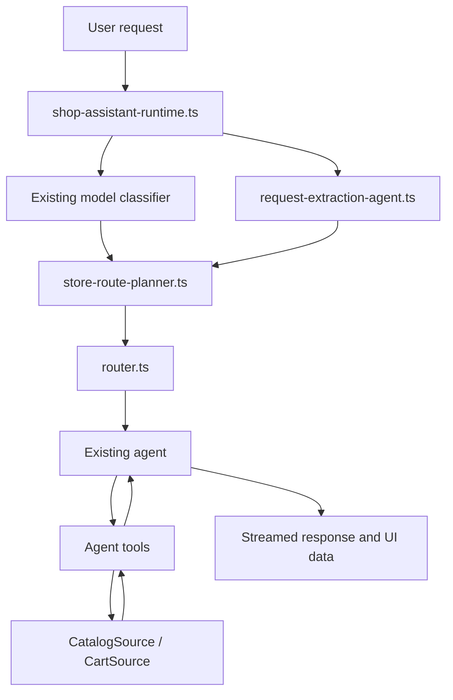
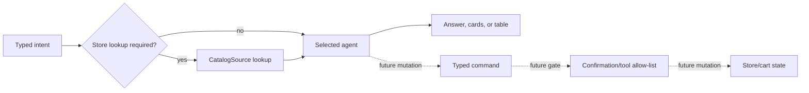

# Shop assistant routing flow

This is the lightweight incremental flow for ShopMate agent routing.



## Current incremental behavior

1. `shop-assistant-runtime.ts` resolves the model and invokes the existing
   model-based query classifier.
2. The same request is passed through `request-extraction-agent.ts`, which
   returns schema-constrained intent, use-case, output, and filter data.
3. The structured request is validated by `store-request-schema.ts`, then
   `store-route-planner.ts` maps the extracted intent to an available agent
   route and records whether the request requires catalog lookup.
4. `router.ts` prefers the planned route when one is available.
5. Existing agents remain responsible for prompting, tools, and streaming.
6. Existing tools call `CatalogSource` or `CartSource` and return structured
   data to the agent and UI.

## Temporary coexistence

The model classifier and structured request extractor currently coexist. The
legacy regex extractor remains only as a fallback if structured extraction
fails. This keeps ambiguous requests on the existing fallback path while the
new request agent is tested against real user queries.

```text
high-confidence intent → planned route → existing agent
ambiguous or unsupported intent → existing classifier/router fallback
```

No existing agent is retired by this flow.

## Planned next steps



- Enforce catalog lookup before product, recommendation, comparison, table,
  filtering, and availability answers.
- Add focused product lookup, comparison, availability, and table agents only
  when their behavior needs a separate implementation.
- Add typed command and tool-gate handling before expanding cart or checkout
  mutations.
