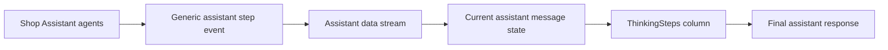

# Agent Thinking Steps Plan

## Goal

Show safe, high-level progress summaries while an assistant request moves through multiple agents. Steps should appear one by one in a vertical column before the final assistant response.

Example:

```text
[Classifying · done]
Understanding the type of request.

[Product classifying · done]
Identifying the relevant product intent.

[Recommendation · loading]
Comparing suitable products.
```

The UI is generic and reusable. Shop Assistant owns the labels and summaries because it owns the business workflow.

## Architectural boundary



The event describes observable progress only. It must not expose private chain-of-thought, raw model reasoning, prompts, credentials, or internal tool arguments.

## Tasks

### 1. Define the reusable event contract — completed

Files:

- [`features/ai-assistant/model/assistant-events.ts`](../../ai-assistant/model/assistant-events.ts)
- [`features/ai-assistant/types/stream.ts`](../../ai-assistant/types/stream.ts)

Work:

- Add an `AssistantStepStatus` union: `loading`, `done`, `error`.
- Add an `AssistantStepEvent` shape containing a stable id, label, optional summary, and status.
- Add the corresponding typed data-stream event.
- Keep the contract business-neutral.

Outcome: any assistant adapter can emit progress steps without importing Shop Assistant types.

### 2. Add a generic stream emitter helper — completed

Files:

- [`features/ai-assistant/data-stream/data-stream-handler.tsx`](../../ai-assistant/data-stream/data-stream-handler.tsx)
- [`features/ai-assistant/data-stream/data-stream-provider.tsx`](../../ai-assistant/data-stream/data-stream-provider.tsx)
- [`features/ai-assistant/model/assistant-events.ts`](../../ai-assistant/model/assistant-events.ts)

Work:

- Forward step events through the existing stream pipeline.
- Define how a step is identified and updated when the same agent changes from `loading` to `done`.
- Preserve event ordering from the server.
- Ignore unknown event types safely.

Outcome: the generic assistant transports progress events without knowing why they exist.

### 3. Add step state to the current message — completed

Files:

- [`features/ai-assistant/model/assistant-events.ts`](../../ai-assistant/model/assistant-events.ts)
- [`features/ai-assistant/components/message-list.tsx`](../../ai-assistant/components/message-list.tsx)
- [`features/ai-assistant/components/message-part-orchestrator-renderer.tsx`](../../ai-assistant/components/message-part-orchestrator-renderer.tsx)

Work:

- Keep the active request's steps separate from the final text content.
- Append new step ids in arrival order.
- Update an existing step rather than rendering duplicates.
- Clear transient steps when a new request starts.
- Decide whether completed steps remain visible after the final response; default to keeping them in the current assistant message.

Outcome: progress is associated with the correct assistant response and cannot leak into the next request.

### 4. Build the reusable vertical UI — completed

Files:

- `features/ai-assistant/components/thinking-steps/thinking-steps.tsx`
- `features/ai-assistant/components/thinking-steps/thinking-step-item.tsx`
- `features/ai-assistant/components/message-list.tsx`

Work:

- Render one step per row in a vertical column.
- Show distinct loading, done, and error states.
- Animate only the active step when appropriate.
- Keep the component presentational and driven entirely by props.
- Support an empty state by rendering nothing.
- Ensure keyboard, color contrast, reduced motion, and screen-reader labels are handled.

Outcome: the generic assistant has a reusable thinking summary UI that can be used by any business adapter.

### 5. Emit steps from Shop Assistant routing — completed

Files:

- [`features/shop-assistant/server/router.ts`](../server/router.ts)
- [`features/shop-assistant/server/shop-assistant-runtime.ts`](../server/shop-assistant-runtime.ts)
- [`features/shop-assistant/server/agents/query-classifier/agent.ts`](../server/agents/query-classifier/agent.ts)
- [`features/shop-assistant/server/agents/product-classifier/agent.ts`](../server/agents/product-classifier/agent.ts)
- [`features/shop-assistant/server/agents/recommendation/agent.ts`](../server/agents/recommendation/agent.ts)
- [`features/shop-assistant/server/agents/filtering/agent.ts`](../server/agents/filtering/agent.ts)
- [`features/shop-assistant/server/agents/products-cart/agent.ts`](../server/agents/products-cart/agent.ts)

Work:

- Add a small injected progress emitter to the runtime or router context.
- Emit `loading` before each meaningful agent operation.
- Emit `done` after successful completion.
- Emit `error` when an agent fails and the request can still produce a fallback response.
- Use concise business summaries such as “Identifying product intent” rather than internal reasoning.
- Avoid emitting a step for trivial helper functions or every model call.

Outcome: multi-agent Shop Assistant requests visibly progress through classification, routing, and recommendation/search work.

Remaining routing work:

- [x] Emit a technical-discussion step when the query takes the technical path.
- [x] Emit a not-related/fallback step when the query does not match a supported business route.
- [ ] Emit product-search and filtering steps when those agents execute.
- [ ] Emit cart-operation steps for meaningful cart work.
- [ ] Keep the stage names stable and user-facing; do not expose raw agent names, model calls, or internal tool lifecycle events.

Expected branch examples:

```text
Classifying · done
Technical discussion · done
Preparing answer · loading
Final response
```

```text
Classifying · done
Product intent · done
Recommendation · done
Catalog search · loading
Final response
```

### 5a. Include artifact names in progress steps — initial implementation completed

Files:

- [`features/shop-assistant/server/agents/technical-discussion/agent.ts`](../server/agents/technical-discussion/agent.ts)
- [`features/shop-assistant/server/agents/recommendation/agent.ts`](../server/agents/recommendation/agent.ts)
- [`features/shop-assistant/server/agents/price-trend/agent.ts`](../server/agents/price-trend/agent.ts)
- [`features/ai-assistant/components/artifacts/text/tool/create-document-tool.ts`](../../ai-assistant/components/artifacts/text/tool/create-document-tool.ts)

Work:

- [x] Emit a `Creating artifact` step when a document-producing tool receives its title.
- [x] Use the artifact title as the step summary, for example `Discussion about iPhone and Samsung phones`.
- [x] Update the same step id from `loading` to `done`; never create duplicate rows for the same artifact.
- Preserve artifact id and kind in the existing artifact events; the thinking-step event is only the user-facing progress summary.
- Support chart, text, code, and sheet artifacts without hard-coding a specific artifact type in the generic assistant.

Expected UX:

```text
Creating artifact · done
Discussion about iPhone and Samsung phones
```

### 5b. Keep progress summaries safe and concise

Work:

- Show high-level work summaries only.
- Do not stream chain-of-thought, hidden prompts, raw model reasoning, tool arguments, or database details.
- Keep completed rows subdued and animate only the active loading row.
- Use `Thinking` as the section label and place the final assistant response immediately after the column.
- Render no thinking section when an assistant runtime emits no progress events.

### 6. Define lifecycle behavior — completed

Files:

- [`features/ai-assistant/hooks/use-chat-submission.ts`](../../ai-assistant/hooks/use-chat-submission.ts)
- [`features/ai-assistant/components/thinking-steps/thinking-steps.tsx`](../../ai-assistant/components/thinking-steps/thinking-steps.tsx)
- [`features/ai-assistant/data-stream/data-stream-handler.tsx`](../../ai-assistant/data-stream/data-stream-handler.tsx)

Decisions:

- `loading` steps remain visible while the request is active.
- A successful step becomes `done` when its agent operation completes.
- A failed step becomes `error`; the final assistant response may explain the fallback.
- The final response renders after the progress column, not instead of it.
- A new request starts a fresh progress sequence.
- Aborted requests mark the active step as cancelled or remove only the transient loading state.

Outcome: the UI behaves predictably across success, failure, retry, and cancellation.

Additional lifecycle requirements:

- [x] Mark text artifact creation steps as done after content completion is available.
- [ ] Mark tool-backed search or cart steps as error when their operation fails but the assistant can continue.
- [ ] Keep completed progress steps visible alongside the final response, while clearing them before the next request.

### 7. Add tests and manual verification

Files:

- `features/ai-assistant/components/thinking-steps/thinking-steps.test.tsx`
- `features/ai-assistant/model/assistant-events.test.ts`
- `features/shop-assistant/server/router.test.ts`
- [`features/ai-assistant/test/in-memory-assistant-persistence.ts`](../../ai-assistant/test/in-memory-assistant-persistence.ts)

Checklist:

- [ ] Generic assistant renders normally when no step events are emitted.
- [ ] Steps appear in server arrival order.
- [ ] A loading step updates to done without duplicating the row.
- [ ] Error steps render an accessible error state.
- [ ] The final message appears after the step column.
- [ ] A second request does not reuse the first request's steps.
- [ ] Shop Assistant can route through more than one agent and emit each step.
- [ ] Technical discussion emits a stage after query classification.
- [ ] Recommendation and filtering branches emit their own stages.
- [ ] Artifact creation displays the artifact name in the same progress row.
- [ ] Artifact progress updates one row instead of appending duplicates.
- [ ] An assistant without Shop Assistant still works.
- [ ] No raw chain-of-thought or sensitive tool arguments are streamed.
- [ ] TypeScript and lint checks pass.

## Expected final structure

```text
features/ai-assistant/
├── components/
│   └── thinking-steps/
│       ├── thinking-steps.tsx
│       └── thinking-step-item.tsx
├── data-stream/
├── model/
│   └── assistant-events.ts
└── types/
    └── stream.ts

features/shop-assistant/
├── server/
│   ├── router.ts
│   └── agents/
└── docs/
    └── agent-thinking-steps-plan.md
```

## Completion criteria

The work is complete when the generic assistant can render an ordered progress column from typed stream events, while Shop Assistant can emit concise progress summaries for its routed agents without the generic feature importing any Shop Assistant code.
