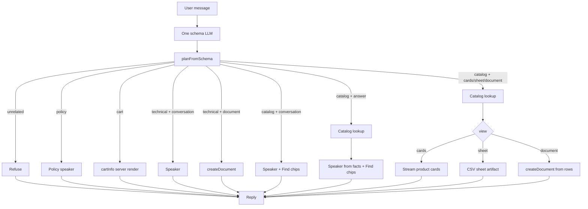

# Architecture

What Shop Assistant is, and why it replaced the previous multi-agent adapter.

## One sentence

One schema LLM labels the request. Runtime lookup, render, and an optional speaker do the rest. No agent router.

## Flow

```text
User message
  → 1 schema LLM
  → planFromSchema
  → lookup? (catalog cards / sheet / document / answer)
  → render view (cards / sheet / document / cart / refuse / policy / conversation + Find chips / answer + Find chips)
  → optional speaker
```



Intent and filters choose lookup. View chooses presentation. Server functions and UI stay dumb. The model never picks a tool.

## LLM schema

Closed enums only. If two values do not change lookup, render, or cart, they do not belong here.

```ts
{
  action: 'catalog' | 'cart' | 'policy' | 'technical' | 'unrelated',
  catalogQuery: string,   // "" = browse all
  category: 'smartphone' | 'laptop' | 'tablet' | 'smartwatch' | 'headphones' | null,
  constraints: {
    minPrice: number | null,
    maxPrice: number | null,
    colors: string[],
    features: string[],
    sortBy: 'relevance' | 'rating' | 'price-low' | 'price-high' | 'reviews' | 'name' | null,
  },
  view: 'cards' | 'sheet' | 'document' | 'conversation' | 'answer',
  metadata: {
    type: 'none' | 'buttons',
    items: Array<{ label: string; value: string }>,  // max 3; value is a CatalogCategory
  },
}
```

| Field | Used by | Not used for |
|---|---|---|
| `action` | skip lookup / refuse / cart / technical / catalog | picking a specialist agent |
| `catalogQuery` + `category` + `constraints` | catalog lookup | presentation |
| `view` | cards vs sheet vs document vs prose vs product Q&A | whether to search (except conversation skip) |
| `metadata` | conversation / answer Find chips (`data-uiMetadata`) | lookup, render choice, or SKU chips |

No `tools` field. Runtime derives render from `action` + `view`. Constraint fields are optional with defaults so omitting `sortBy` does not drop a valid label. Metadata default is `{ type: 'none', items: [] }`.

### Examples

**Show me smart phones**

```json
{
  "action": "catalog",
  "catalogQuery": "smartphone",
  "category": "smartphone",
  "view": "cards",
  "metadata": { "type": "none", "items": [] }
}
```

**What features does the iPhone 15 Pro Max have?**

```json
{
  "action": "catalog",
  "catalogQuery": "iphone 15 pro max",
  "category": "smartphone",
  "view": "answer",
  "metadata": { "type": "none", "items": [] }
}
```

Runtime looks up the product, speaker cites store facts, Find chip = **iPhone 15 Pro Max** (from lookup rows, not schema metadata).

**All available products in a table**

```json
{
  "action": "catalog",
  "catalogQuery": "",
  "category": null,
  "view": "sheet",
  "metadata": { "type": "none", "items": [] }
}
```

**Buying guide for our smartphones**

```json
{
  "action": "catalog",
  "catalogQuery": "smartphone",
  "category": "smartphone",
  "view": "document",
  "metadata": { "type": "none", "items": [] }
}
```

**Windows vs Mac laptops**

```json
{
  "action": "technical",
  "catalogQuery": "",
  "category": null,
  "view": "document",
  "metadata": { "type": "none", "items": [] }
}
```

**Edit my cart**

```json
{
  "action": "cart",
  "catalogQuery": "",
  "category": null,
  "view": "conversation",
  "metadata": { "type": "none", "items": [] }
}
```

**Diary on the go, what products match?**

```json
{
  "action": "catalog",
  "catalogQuery": "",
  "category": null,
  "view": "conversation",
  "metadata": {
    "type": "buttons",
    "items": [
      { "label": "Smartphones", "value": "smartphone" },
      { "label": "Tablets", "value": "tablet" }
    ]
  }
}
```

**Which is better, tablets or laptops for travel?**

```json
{
  "action": "catalog",
  "catalogQuery": "",
  "category": null,
  "view": "conversation",
  "metadata": {
    "type": "buttons",
    "items": [
      { "label": "Tablets", "value": "tablet" },
      { "label": "Laptops", "value": "laptop" }
    ]
  }
}
```

**Provide tablets from the catalog** (Find chip click)

```json
{
  "action": "catalog",
  "catalogQuery": "tablet",
  "category": "tablet",
  "view": "cards",
  "metadata": { "type": "none", "items": [] }
}
```

## Planner

Pure function. No model. `planFromSchema({ action, view })` → `ExecutionPlan`.

Filters stay on `AssistantRequest` for lookup. View never overrides action.

| action | view | lookup | render | speaker |
|---|---|---|---|---|
| `unrelated` | * | no | refuse | reply |
| `policy` | * | no | policy | reply |
| `cart` | * | no | cart | confirm |
| `technical` | `document` | no | document | confirm |
| `technical` | other | no | conversation | reply |
| `catalog` | `cards` | yes | cards | confirm |
| `catalog` | `sheet` | yes | sheet | confirm |
| `catalog` | `document` | yes | document | confirm |
| `catalog` | `answer` | yes | answer (no cards) + Find chips from product names | reply |
| `catalog` | `conversation` | when category or query set | conversation + cite products if rows + Find chips | reply |

`planFromSchema` still sets `requiresCatalogLookup: true` for every catalog action. Runtime lookup skips when `render === 'conversation'`. `answer` looks up for speaker facts but never streams cards. `view` chooses listing vs Q&A vs discussion. `metadata.buttons` chooses Find chips.

`cart` + `document` still renders cart. `unrelated` + `sheet` still refuses. Technical only honors `document`; `cards` / `sheet` on technical become conversation so we do not invent catalog rows.

Then execute in order: lookup → render → optional speaker.

## Runtime

`server/request-agent.ts` is the one schema LLM (`generateObject` + `validateAssistantRequest`). On failure it uses `DEFAULT_ASSISTANT_REQUEST` (`catalog` + `conversation`), not a second classifier.

`server/shop-assistant-runtime.ts` runs:

1. Label the request (`action`, filters, `view`, `metadata`).
2. `planFromSchema`.
3. Catalog lookup when `requiresCatalogLookup` and `render !== 'conversation'`.
4. Server render (`server/render/store-output`, `server/render/cart`, `server/render/ui-metadata`, refuse/policy text).
5. Optional speaker (`server/speaker.ts`, no tools). Refuse, policy, and empty card/sheet/document lookup stay deterministic.

Node logs: `REQUEST SCHEMA`, `EXECUTION PLAN`, `CATALOG LOOKUP`, `RENDER`, `SPEAKER`. Injected by `/api/ai-assistant`.

### Thinking steps

The UI thinking panel is fed by transient `data-assistantStep` events. Generic assistant only renders them; Shop Assistant owns the labels via [`lib/runtime-steps.ts`](../lib/runtime-steps.ts).

```text
Classifying → action gate → Checking store? → presentation → Creating artifact? → resolution
```

| Step | When |
|---|---|
| Classifying | Always (schema LLM) |
| Catalog / Cart / Store policy / Technical discussion / Not related | Always after `planFromSchema` |
| Checking store | When `shouldLookup` |
| Showing products / Preparing table / Preparing document / Answering product / Preparing response | When render adds signal beyond the action |
| Creating artifact | Sheet/document artifact helpers (existing) |
| Resolution (`kind: 'resolution'`) | Always after deterministic work finishes (`done` or `error`) |

While steps are still loading, the panel shows every detail row. After the resolution event arrives:

- **≤ 2 detail steps** — stay expanded (no collapser).
- **> 2 detail steps** — collapse under `[CircleCheck | CircleX] {resolution.label}` with a chevron; expand to see the detail list.

Examples (live / short):

```text
Classifying · done
Cart · done
→ Cart ready   (≤ 2 details; no collapse)
```

Examples (collapsed after finish):

```text
✓ Products ready  ▾
  Classifying · done
  Catalog · done
  Checking store · done
  Showing products · done
```

```text
✓ Table ready  ▾
  Classifying · done
  Catalog · done
  Checking store · done
  Preparing table · done
  Creating artifact · done
```

## Lookup

Catalog lookup does **not** use AI. `CatalogSource.searchProducts` is deterministic (`lib/catalog/match-catalog-products.ts`).

This node owns unique catalog values (`category`, name, keywords) and decides which rows come back:

1. Read distinct `product.category` values from the catalog.
2. Resolve the query to one of those values (longest n-gram / alias wins: `"smart phones"` → `smartphone`).
3. If a category resolves, keep `product.category === that value`.
4. Match leftover brand/model tokens with word boundaries. Do not OR-match substrings inside `"headphones"` / `"smartwatch"`.
5. Empty `catalogQuery` is browse-all (constraints may still apply). Runtime uses `isBrowseAllCatalogRequest` to empty the query.

If lookup already ran, do not search again inside a `productSearch` AI tool.

## Render

| `action` + `view` | lookup | What runs |
|---|---|---|
| `unrelated` | no | refuse text |
| `policy` | no | policy text |
| `cart` | no | cart UI from `CartSource` |
| `technical` + `conversation` | no | speaker |
| `technical` + `document` | no | text artifact (`createDocument` server fn) |
| `catalog` + `cards` | yes | stream product cards from rows |
| `catalog` + `sheet` | yes | CSV → sheet artifact |
| `catalog` + `document` | yes | text artifact filled from rows |
| `catalog` + `answer` | yes | speaker from store facts + Find chips from matched product names (no cards) |
| `catalog` + `conversation` | skip | speaker + optional `data-uiMetadata` Find chips |

Conversation never streams product cards. Answer never streams product cards either — it looks up so the speaker can cite real features. `view` is listing vs Q&A vs discussion. Find chips come from schema `metadata`. Click is a visible user turn: `Provide ${value} from the catalog`. See [`conversation.md`](./conversation.md).

Shop + document is not a new agent. It is `action: catalog` + `view: document`. If it is shop, the document is filled from lookup, not invented by the model.

Server functions:

| Render | What streams |
|---|---|
| `cards` | transient `data-productCard` + persisted `data-productCards` |
| `sheet` | `createSheetDocument` with catalog CSV + `data-artifactContent` |
| `catalog document` | `createTextDocument` with row markdown + `data-artifactContent` |
| `technical document` | `createTextDocument` from the topic (no lookup rows) |
| `cart` | transient `data-cartUpdate` + persisted `data-cart` |
| `catalog conversation` / `catalog answer` | persisted `data-uiMetadata` when `metadata.type === 'buttons'` |
| `refuse` / `policy` | deterministic text stream |

Chat remounts cards/cart/Find chips from persisted `data-productCards` / `data-cart` / `data-uiMetadata` via `ui/integration/stream-part-registry.tsx`. Artifacts mount from `data-artifactContent`. See [`stream-parts.md`](./stream-parts.md).

## Speaker

One optional `streamText` after render (`server/speaker.ts`). No tools. No inventing SKUs.

- Conversation: answer the question in full. Do not confirm briefly. Category hints may be mentioned; Find chips are a separate `data-uiMetadata` part, not markdown.
- Answer: reply in full from STORE CONTEXT (lookup facts). No cards. Optional Find chips.
- Cards / sheet / document / cart: confirm briefly.
- Refuse, policy, and empty card/sheet/document lookup: deterministic text.

## Expected replies

| Prompt | Result |
|---|---|
| Show me smart phones | Cards: Galaxy + iPhone only |
| what features the iphone 15 pro max has? | AI text from store facts + Find [iPhone 15 Pro Max], no cards |
| All available products in a table | Sheet artifact from real catalog CSV, preview in chat |
| Buying guide for our smartphones | Text artifact citing lookup rows |
| Windows vs Mac laptops | Technical text artifact, no fake SKUs |
| Edit my cart | Cart UI, no catalog lookup |
| Who is Elon Musk? | Short refuse, no lookup |
| diary on the go, what products can be matching? | AI text + Find [Smartphones] [Tablets], no cards |
| tablets or laptops for travel? | AI text + Find [Tablets] [Laptops]; click → cards |
| should i get an iphone or a samsung galaxy? | AI text citing store phones + Find [iPhone…] [Galaxy…], no cards |

## Why this over the previous adapter

The previous adapter already had the right idea — intent/filters vs output format — then kept a multi-agent shell on top of it.

```text
query-classifier
  → request-extraction
  → store-route-planner
  → catalog lookup
  → render-store-output
  → router
  → products | recommendation | filtering | technical | not-related | price-trend
       → AI tools (productSearch, cartInfo, createDocument)
```

That caused four problems:

1. **Too many files for one decision.** Classifier, extractor, planner, router, and five speakers mostly did the same `streamText` + tools loop with different prompts.
2. **`table` / document leaked into routing.** Output wording was treated like an agent choice. Catalog tables were invented instead of filled from lookup.
3. **AI tools searched again.** After lookup, `productSearch` ran a second, worse search. The model also chose when to call tools.
4. **Lookup did not use unique catalog values.** `"smart phone"` split into `smart` + `phone` and matched smartwatch / headphones via substring.

Shop Assistant keeps what worked:

- retrieval before generation
- `outputFormat` / view as presentation, not intent
- sheet artifacts from real CSV
- `CatalogSource` / `CartSource` contracts
- `features/ai-assistant` stays generic; this feature stays the ShopMate adapter

…and drops what did not: specialist agents, AI tool wrappers for catalog/cart, and a second search after lookup.

## What this is not

- Not a bigger prompt with more tools.
- Not embeddings or AI ranking inside lookup (unless we add it later as an explicit node).
- Not cart mutations authorized by schema. `action: cart` only means show cart UI.
- Not dumping catalog cards on rec / compare / product Q&A. Schema `view` chooses cards vs answer vs conversation; `metadata` chooses Find chips; click starts a visible `Provide X from the catalog` turn.
- Not a third runtime living beside the old multi-agent adapter. This folder is the live adapter.
